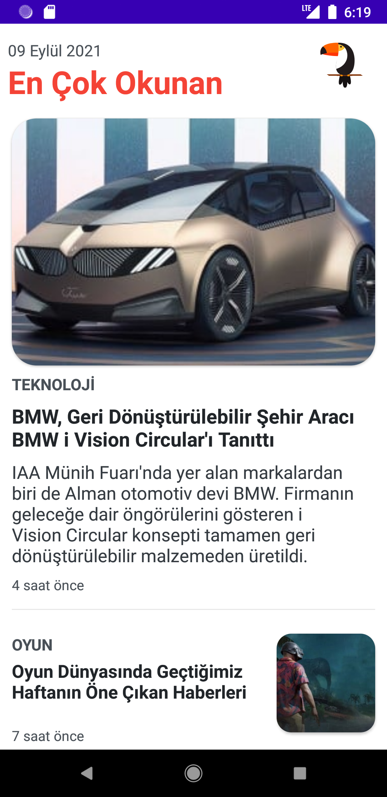
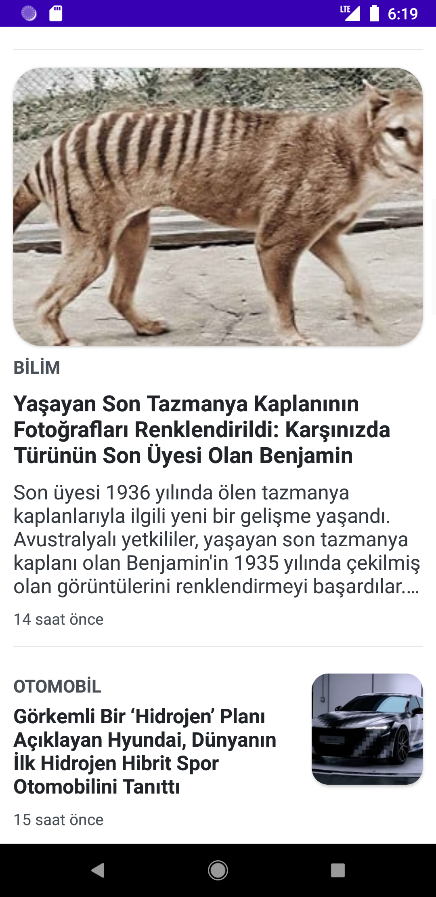

# KekodChallenge2NewsApp
### I developed a news app. In this project my main library was **fragment**. The app design belongs to Webtekno mobile ios app. It just a trainig app to improve fragment using skills.

- There are two diffrent news item as fragment. Each fragment added to fragment container.
- When user click any of them the detail screen appear with fragment replace structure.
- Also nice lottie animations was used to get better ui experince.

     

    

<pre><code>Copyright 2021 Ahmet Faruk Çuha</code></pre>

---

    

